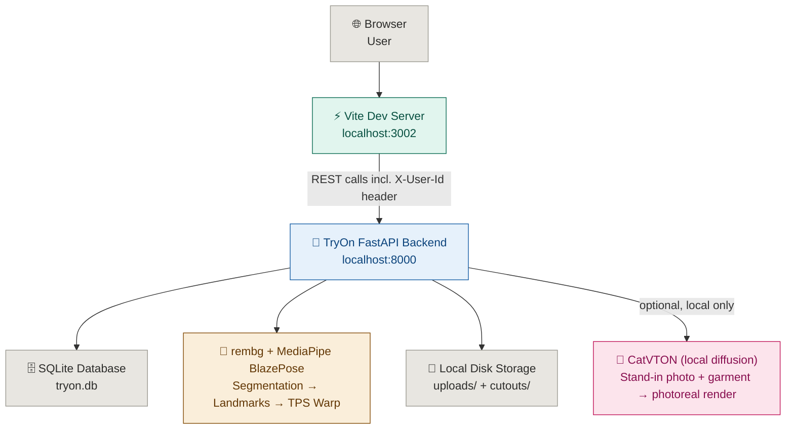

<div align="center">

[](https://github.com/ria0304/TryOn)


# TryOn — Build, Compare, and Perfect Outfits

**Upload it. Cut it out. Dress it up. Compare the looks. See it for real.**

TryOn turns any clothing screenshot — Pinterest, Instagram, an online store — into a clean transparent garment cutout, fits it to a virtual mannequin, and lets you build, save, and compare full outfit combinations. When you want to see a look rendered photorealistically instead of as a low-poly mannequin, an optional local AI pipeline can do that too — no photo of you required, and no external API.

</div>

---

## The Problem

Planning an outfit from things you've saved or seen online is clumsy.

**Screenshots pile up** in a camera roll with no way to combine them, compare them side by side, or see how pieces actually look together.

**Virtual try-on tools** that exist mostly generate a photorealistic image of a person wearing one outfit at a time — slow, expensive to run, and useless for quickly comparing five variations of the same look.

---

## The Solution

TryOn separates two things that are usually bundled together: **fast outfit composition** and **photorealistic rendering**.

A user uploads a garment photo from anywhere:

- A **Pinterest / Instagram screenshot**
- A **product photo** from an online store
- Any photo from their **own gallery**

The system outputs:

- A **transparent garment cutout** (background removed automatically)
- A **suggested category** (top, bottom, dress, jacket, shoes, bag, jewellery, accessories)
- An **intelligently fitted placement** on a virtual mannequin — either the 2D paper-doll (warped to match body landmarks) or the 3D mannequin, selectable across feminine/masculine/neutral avatars, with garments draped as a silhouette-fitted 3D shell that wraps almost the full 360° around the body (not just a flat cutout facing the camera) so it reads as actually worn from every angle, front, sides, and back
- A **reusable Garment Library** entry, so the same piece can be mixed into any future outfit
- A way to **build, save, and compare** full outfit combinations, and export a finished look as a shareable "magazine cover"
- Optionally, a **photorealistic render of the same look** — the mannequin's outfit, rendered on a photorealistic stand-in body instead of the low-poly mesh, generated fully on your own machine

---

## Core User Flow

```
Garment screenshot (Pinterest / Instagram / store / gallery)
        ↓
POST /api/uploads/garment
        ↓
rembg background removal  +  BlazePose-based canonical garment-only
extraction (strips leftover head/limb/hand pixels, records contours +
bounding box, never fills holes or invents fabric)  +  category suggestion
        ↓
Saved to Garment Library (scoped to guest user)
        ↓
Outfit Builder: MediaPipe BlazePose landmarks → TPS warp → fitted onto mannequin
        ↓
Save outfit  →  Compare Mode (lock pieces, cycle the rest)  →  Runway Photobooth export
        ↓
(optional) Photorealistic Try-On → local CatVTON pipeline renders the same
outfit on a photorealistic stand-in body matched to the mannequin's avatar
```

---

## Features

| Feature | Status |
|---|---|
| Garment upload + automatic background removal (`rembg`) | ✅ verified — 122-test backend suite runs the real `rembg` model (not mocked) end-to-end through the upload endpoint |
| Canonical garment-only extraction (`services/garment_segmentation.py`) — removes BlazePose-identified head/limb/hand pixels left behind by `rembg`, records contours/bounding box/confidence/warnings, and deliberately never fills holes, mirrors missing fabric, or applies a largest-component rule, so the saved asset only ever contains photographed garment pixels | ✅ verified — `test_canonical_garment_asset.py` covers hole/disconnected-part preservation and pose-pixel removal; wired live into `/api/uploads/garment` (not a standalone/unused module) |
| Category suggestion — FashionCLIP (`patrickjohncyh/fashion-clip`) zero-shot vision classifier, decision tree ported directly from the WYA project's field-tested `identify_garment` logic | ✅ the decision-tree logic and the aspect-ratio heuristic fallback are unit-tested here (`test_classification.py`); the CLIP inference itself has been validated against real garment photos in the WYA project this logic was ported from |
| Dominant color detection — KMeans clustering on the masked garment cutout, mapped to a 58-name color dictionary, auto-fills the color swatch | ✅ verified — real KMeans clustering exercised in `test_color_detection.py`, plus live through the upload endpoint integration test |
| Fabric classification — texture variance/brightness (OpenCV) + pattern detection (Canny edges, Sobel orientation histogram) feed a rule-based classifier ported directly from the WYA project's `FabricClassifier`, auto-suggesting a fabric (e.g. Denim, Silk, Leather, Knit, Chiffon) alongside the detected color and category | ✅ verified — `test_fabric_classification.py` covers the rule-based classifier's branches (denim shortcut, leather/knit/velvet detection, per-category defaults) plus texture/pattern analysis against synthetic solid-color and checkerboard images |
| Garment Library (8 categories, per-user, reusable) | ✅ verified — full CRUD + cross-user isolation covered in `test_api_garments.py` |
| Intelligent garment fitting (MediaPipe BlazePose + OpenCV/SciPy TPS warp) | ✅ verified — TPS/affine warp math and the mannequin reference landmarks are unit-tested; the full pipeline runs (via real MediaPipe) inside the upload endpoint integration test |
| Outfit Builder canvas (drag, resize, rotate, flip, lock, shuffle) | ✅ |
| SVG paper-doll mannequin with 6 selectable hairstyles | ✅ |
| 3D mannequin (React Three Fiber + rigged GLTF, garments as a silhouette-fitted 3D shell, drag-to-rotate / scroll-to-zoom) | ✅ garments wrap ~345° around the body (front, sides, back) instead of a flat front-facing cutout — the shell samples the actual photo across its real width and extends a clamped, shaded fabric tone into the sides/back where no photo data exists, so there's no bare-mannequin gap when rotating. Extreme flared hems (e.g. a full skirt) can still show a faint seam directly at back-center |
| Multi-avatar 3D models (feminine / masculine / neutral) | ⚠️ distinct models wired + persisted per outfit, cross-avatar fit unverified in-browser |
| **Photorealistic Try-On — local diffusion pipeline (CatVTON), no external API/key** | ⚠️ optional, off by default — requires a one-time manual setup (see [`backend/third_party/CATVTON_SETUP.md`](backend/third_party/CATVTON_SETUP.md)) and real GPU/CPU compute; not covered by the automated test suite (needs downloaded model weights, not run in CI). Renders the mannequin's equipped outfit onto a **bundled stand-in photo** picked by avatar type — never a photo of the app's user |
| Outfit Library (save/reuse full combinations) | ✅ verified — CRUD + dress/top/bottom exclusivity rule covered in `test_api_outfits.py` |
| Compare Mode (lock garments, batch-cycle the rest) | ✅ |
| Stylist progression layer — XP/level badge + quests modal | ✅ wired into `Header`/`App.tsx`, with each quest genuinely gated on real in-app conditions (a real upload, a real saved outfit, actually opening Compare mode, etc.) rather than being freely claimable |
| Stylist progression layer — live style-score meter (`StyleMeter.tsx`) | ✅ mounted in the Outfit Builder's right-hand panel |
| Runway Photobooth export (magazine-style outfit cards) | ✅ mounted — launches from the Style Meter's "Snapshot Look" button in the Outfit Builder |
| Guest account auth (`X-User-Id`, self-healing on stale id) | ✅ verified — 401-not-404 on stale id, cross-user isolation, and auto-recovery behavior all covered in tests |
| Cloud storage (AWS S3) | 🔜 planned |
| CI/CD + cloud deployment | 🔜 planned |

## Architecture



---

## Tech Stack

**Frontend**
- React 19 + TypeScript + Vite
- Tailwind CSS 4
- `motion` (Framer Motion), `lucide-react`
- `three`, `@react-three/fiber`, `@react-three/drei` — 3D mannequin rendering, orbit controls, GLTF loading, silhouette-driven garment shell wrapped ~345° around the body

**Backend**
- FastAPI (Python)
- SQLAlchemy + SQLite
- Pydantic

**AI / Computer Vision**
- `rembg` — background removal
- FashionCLIP (`patrickjohncyh/fashion-clip` via `transformers`/`torch`) — zero-shot garment category classification, aspect-ratio heuristic as fallback
- MediaPipe BlazePose — body landmark detection
- OpenCV + SciPy — thin-plate-spline garment warping
- Pillow — image handling

**Photorealistic Try-On (optional)**
- [CatVTON](https://github.com/Zheng-Chong/CatVTON) (mask-free variant) — open-source diffusion virtual try-on model, run locally via `diffusers` + `accelerate`, weights pulled from Hugging Face once and cached
- No API key, no per-request network call after the first weight download
- Renders onto a small set of bundled stand-in photos (feminine/masculine/neutral), never a photo of the app's user — see [Photorealistic Try-On](#photorealistic-try-on) below

---

## Project Structure

```
TryOn/
│
├── backend/                          # All Python server-side logic
│   ├── main.py                       # FastAPI app, CORS, static files, DB init
│   ├── config.py                     # paths, CORS origins, upload limits, try-on device
│   ├── categories.py                 # categories + layer order (single source of truth)
│   ├── classification.py             # FashionCLIP zero-shot classifier, heuristic fallback
│   ├── color_detection.py            # KMeans dominant-color detection, median fallback
│   ├── fabric_classification.py      # Texture/pattern analysis (OpenCV) + WYA's rule-based FabricClassifier
│   ├── auth.py                       # X-User-Id ownership dependency
│   ├── requirements.txt
│   ├── pytest.ini
│   ├── tests/                        # 120 tests, 13 files — see Testing section below
│   ├── database/
│   │   ├── database.py
│   │   ├── models.py                 # SQLAlchemy models (User, Garment, Outfit)
│   │   └── schemas.py                # Pydantic schemas (camelCase to match types.ts)
│   ├── routers/
│   │   ├── users.py
│   │   ├── meta.py
│   │   ├── garments.py
│   │   ├── outfits.py
│   │   ├── uploads.py
│   │   └── tryon.py                  # photorealistic try-on endpoint (status + generate)
│   ├── services/
│   │   ├── segmentation.py           # rembg background removal
│   │   ├── landmark_detector.py      # MediaPipe BlazePose
│   │   ├── warping.py                # thin-plate-spline warp engine
│   │   ├── mannequin_manager.py      # reference landmarks for the 2D mannequin
│   │   ├── layering.py               # alpha-composites garments onto mannequin
│   │   ├── fitting_service.py        # orchestrates the pipeline above
│   │   └── tryon_service.py          # loads/runs the local CatVTON diffusion pipeline
│   ├── evaluation/                   # baseline comparison + ablation study — see Evaluation section below
│   │   ├── synthetic_garments.py     # procedural garment silhouettes (no sample dataset in-repo)
│   │   ├── baselines.py              # Resize / Affine / TPS / TPS+silhouette / Proposed
│   │   ├── metrics.py                # landmark error, silhouette IoU, flare distortion
│   │   ├── run_experiments.py        # -> results/summary_table.md, qualitative_grid.png
│   │   ├── run_ablation.py           # -> results/ablation_table.md
│   │   └── results/                  # generated CSVs, tables, qualitative grid (not hand-written)
│   ├── third_party/
│   │   ├── CATVTON_SETUP.md          # one-time manual setup for photorealistic try-on
│   │   ├── catvton/                  # git-ignored — you clone CatVTON's repo here yourself
│   │   └── standin_models/           # bundled stand-in photos (feminine/masculine/neutral)
│   └── storage/
│       ├── uploads/                  # raw uploaded photos
│       ├── cutouts/                  # background-removed PNGs
│       └── tryon_results/            # generated photorealistic renders
│
├── src/                               # React + TypeScript frontend
│   ├── App.tsx                        # root component, state, tab routing
│   ├── types.ts
│   ├── main.tsx
│   ├── lib/
│   │   ├── api.ts                     # fetch client for the FastAPI backend
│   │   └── sound.ts                   # UI sound effects
│   ├── data/
│   │   ├── defaultGarments.ts
│   │   └── defaultPlacements.ts       # per-category default x/y/scale for the 2D canvas
│   └── components/
│       ├── LoginScreen.tsx            # stylist name/PIN/archetype
│       ├── AnimatedBackground.tsx
│       ├── OutfitBuilderCanvas.tsx    # 2D mannequin + draggable garment layers
│       ├── ThreeMannequin.tsx         # 3D mannequin, silhouette-fitted garment shell wrapped ~345° around the body
│       ├── WardrobePanel.tsx
│       ├── UploadModal.tsx
│       ├── MyGarmentsView.tsx
│       ├── MyOutfitsView.tsx
│       ├── CompareView.tsx
│       ├── StyleMeter.tsx
│       ├── StylistLevelBadge.tsx
│       ├── StylistQuestsModal.tsx
│       ├── StyleInspirationPresets.tsx
│       ├── RunwayPhotoboothModal.tsx
│       └── PhotorealisticTryOnModal.tsx  # photorealistic render UI, no upload step
│
├── public/
│   └── models/
│       ├── mannequin.glb               # legacy proxy mesh, fallback if an avatar file is missing
│       ├── mannequin_feminine.glb      # multi-mesh (Body/Feet/Head/Legs)
│       ├── mannequin_masculine.glb     # single mesh
│       └── mannequin_neutral.glb       # single mesh
│
├── .env.example
├── index.html
├── package.json
├── tsconfig.json
└── vite.config.ts
```

---

## Run Locally

Both the frontend and backend must run simultaneously.

**Step 1 — Clone and install**

```bash
git clone https://github.com/ria0304/TryOn.git
cd TryOn
```

**Step 2 — Start the backend** (Terminal 1)

```bash
cd backend
python -m venv venv && source venv/bin/activate   # optional but recommended
pip install -r requirements.txt
uvicorn main:app --reload --port 8000
```

The SQLite database (`backend/tryon.db`) is created automatically on first run — empty until a user registers.

> The Photorealistic Try-On feature is **optional** and not required for the rest of the app to work. If you don't need it, skip its extra dependencies at the bottom of `requirements.txt`. To enable it, see [Photorealistic Try-On](#photorealistic-try-on) below before continuing.

**Step 3 — Register a guest account**

```bash
curl -X POST http://localhost:8000/api/users
# -> {"id": "user-a1b2c3d4e5f6...", "label": null, "createdAt": "..."}
```

Persist the returned `id` and send it as the `X-User-Id` header on every subsequent request. There's no password login — this is a per-browser guest library.

**Step 4 — Start the frontend** (Terminal 2)

```bash
npm install
npm run dev
```

**Step 5 — Open the app**

```
http://localhost:3002
```

Reads the backend URL from `VITE_API_URL` in `.env` (defaults to `http://localhost:8000` if unset).

---

## Photorealistic Try-On

Everything above renders the outfit on a stylized low-poly 3D mannequin. The **Photorealistic Try-On** button (in the Outfit Builder's Style Meter panel) does the same thing but rendered as a realistic photo instead — a local diffusion model dresses a bundled stand-in body in whatever's equipped on the mannequin.

**No photo of the app's user is ever involved.** The "person" input is always one of three bundled stand-in photos, matched to the mannequin's existing avatar setting (feminine/masculine/neutral) — same concept as picking a mannequin body type today, just rendered photorealistically.

This is optional and off by default. It needs a one-time manual setup because the model it wraps, [CatVTON](https://github.com/Zheng-Chong/CatVTON), isn't pip-installable:

```bash
# 1. Clone CatVTON's repo into backend/third_party/
git clone https://github.com/Zheng-Chong/CatVTON.git backend/third_party/catvton

# 2. Copy 3 stand-in photos from CatVTON's own demo folder
#    (see backend/third_party/CATVTON_SETUP.md step 3 for exact paths)
mkdir -p backend/third_party/standin_models
cp backend/third_party/catvton/resource/demo/example/person/<...>.jpg \
   backend/third_party/standin_models/standin_feminine.jpg
# ...repeat for standin_masculine.jpg and standin_neutral.jpg

# 3. Install the extra Python deps (already listed in requirements.txt)
pip install -r backend/requirements.txt

# 4. Restart the backend
uvicorn main:app --reload --port 8000
```

Full walkthrough, including where CatVTON's demo photos live and how to pick sensible ones per avatar: [`backend/third_party/CATVTON_SETUP.md`](backend/third_party/CATVTON_SETUP.md).

**What happens after setup:** `GET /api/tryon/status` tells the frontend whether it's ready (repo cloned + stand-in photos present). The first real generation call downloads CatVTON's pretrained weights (a few GB) from Hugging Face once, caches them locally, and every call after that is fully offline.

**Performance** — this is the real cost of running your own pipeline instead of a hosted API:

| Hardware | Rough time per image |
|---|---|
| NVIDIA GPU (8GB+ VRAM) | ~5–15 seconds |
| Apple Silicon (`TRYON_DEVICE=mps`) | ~30–90 seconds |
| CPU only (default) | 2–10+ minutes |

Set `TRYON_DEVICE` in `backend/.env` (`cpu`, `cuda`, or `mps`) to match your hardware.

**License note:** CatVTON's weights are released under **CC BY-NC-SA 4.0** — non-commercial use only. Fine for personal use/demos; relevant if this app is ever monetized.

---

## Verify the backend is working

```bash
curl http://localhost:8000/docs
```

This opens the FastAPI auto-generated docs page. Or hit the upload endpoint directly:

```bash
curl -X POST http://localhost:8000/api/uploads/garment \
  -H "X-User-Id: user-a1b2c3d4e5f6..." \
  -F "file=@/path/to/garment.jpg"
```

To check whether the photorealistic try-on pipeline is set up:

```bash
curl http://localhost:8000/api/tryon/status
# -> {"ready": false, "repoCloned": false, "standinPhotosPresent": false, "weightsCached": false}
```

---

## Common Issues

| Problem | Fix |
|---|---|
| Missing `X-User-Id` header | Register via `POST /api/users` first, then send the returned id on every request |
| `rembg`/`mediapipe`/`opencv` install conflicts | Use a clean virtualenv; pin versions in `requirements.txt` if pip resolves an incompatible numpy |
| Port 8000 already in use | Find and kill the process, or run with `--port` set to something else and update `VITE_API_URL` |
| Frontend shows blank / API errors | Make sure the backend is running first, and that `VITE_API_URL` matches its port |
| 401 on every request | Stale `X-User-Id` — `src/lib/api.ts` clears `localStorage` and re-registers automatically on 401 |
| First upload is slow / backend logs show model download | Normal — `classification.py` downloads FashionCLIP weights (~600MB) from Hugging Face on first use and caches them. Needs outbound network access on that first run only |
| "Photorealistic Try-On" button shows "not set up" | Expected until you complete the manual CatVTON setup — see [Photorealistic Try-On](#photorealistic-try-on) above |
| First photorealistic generation is very slow / logs show a weight download | Normal — CatVTON's weights (a few GB) download once from Hugging Face on first use, same idea as the FashionCLIP download, just larger. Fully offline afterward |
| Photorealistic generation takes minutes | Expected on CPU — see the performance table above. Set `TRYON_DEVICE=cuda` or `mps` in `backend/.env` if you have compatible hardware |

---

## Deployment

Not yet configured. The app runs locally — see **Run Locally** above.

Planned: containerize the backend, move `backend/storage/` to AWS S3, and front the frontend with CloudFront + GitHub Actions CI/CD.

---

## Environment Variables

| Variable | Required | Description |
|---|---|---|
| `VITE_API_URL` | No | Backend URL for the frontend (default: `http://localhost:8000`) |
| `TRYON_DEVICE` | No | Backend-only. Device for the photorealistic try-on pipeline: `cpu` (default), `cuda`, or `mps`. Irrelevant if you don't use that feature |

---

## API Endpoints

| Method | Endpoint | Description |
|---|---|---|
| `POST` | `/api/users` | Register a guest account, seeds the default garment catalog |
| `GET` | `/api/meta/categories` | Category list + avatar z-index for each |
| `GET` | `/api/garments` | List the current user's garments (`?category=`, `?search=`) |
| `GET` | `/api/garments/by-categories?categories=top,bag` | Batch fetch grouped by category (Compare Mode) |
| `GET` | `/api/garments/{id}` | Get one garment |
| `POST` | `/api/garments` | Create a garment |
| `PATCH` | `/api/garments/{id}` | Update a garment |
| `DELETE` | `/api/garments/{id}` | Delete a garment (also strips it from any outfit referencing it) |
| `GET` | `/api/outfits` | List the current user's outfits |
| `GET` | `/api/outfits/{id}` | Get one outfit (garments expanded inline) |
| `POST` | `/api/outfits` | Create an outfit (`400` if `dress` is combined with `top`/`bottom`) |
| `DELETE` | `/api/outfits/{id}` | Delete an outfit |
| `POST` | `/api/uploads/garment` | Upload a photo, get back original URL, `rembg` cutout URL, intelligent `warped` URL, a `canonical_asset` object (bounding box, contours, confidence, warnings, plus its own `url`/`alpha_mask_url`) from the garment-only extraction step, and a suggested category, dominant color (hex + name), and fabric |
| `GET` | `/api/tryon/status` | Whether the photorealistic try-on pipeline is set up and ready (repo cloned, stand-in photos present, weights cached) |
| `POST` | `/api/tryon` | Generate a photorealistic render — body: `{ avatar, garmentImageUrl, category }`. No person photo field; the stand-in photo is picked server-side by `avatar` |
| `POST` | `/api/analyze-garment` | Strap/back-topology CV analysis (`PythonStrapCVAnalyzer`), merged in from the `3d-mannequin-garment-viewer` project — body: `{ imageUrl? | garmentId?, category? }` |
| `POST` | `/api/reconstruct-3d` | Generates 3D ribbon control-point specs for a strap layout (`thin_double_straps`, `halter_neck`, …) — body: `{ strapType, backStyle, isBackDetermined, liningColor?, wrapRepeatX? }` |
| `GET` | `/api/health` | Health check |

> **Note:** `backend/main.py` was overwritten during the mannequin-swap merge with the `3d-mannequin-garment-viewer` project's standalone strap-analysis backend, which briefly meant only `/api/health` and the two strap-analysis routes above were actually being served — every other route in this table (still fully implemented in `routers/*.py`) wasn't wired in. This has been fixed: `main.py` now mounts every router, including the strap-analysis one (moved into `routers/strap_analysis.py` to match the rest of the codebase), plus CORS, `/static` file serving, and DB init on startup. `requirements.txt` was also missing several dependencies the code actually imports (`sqlalchemy`, `rembg`, `mediapipe`, `opencv-python-headless`, `scipy`, `scikit-learn`, `python-multipart`) — added, with `mediapipe` pinned to `>=0.10.13` since `0.10.9` isn't available for current Python/platform builds.

---

---

## Evaluation

Separate from the pytest suite below (which checks the code behaves as
written), `backend/evaluation/` measures **how good the fitting is** —
baseline comparison and an ablation study, run against 10 procedurally
generated garment silhouettes (no sample photo dataset ships in this repo,
so the harness generates its own varied tops/dresses/bottoms rather than
skipping evaluation entirely).

```bash
cd backend/evaluation
python3 run_experiments.py   # Resize / Affine / TPS / TPS+silhouette / Proposed
python3 run_ablation.py      # toggle similarity transform / landmarks / silhouette conform / depth shading
```

Every baseline is a different composition of the app's own real
`warping.py` / `landmark_detector.py` functions — nothing is
reimplemented for the comparison. Headline, reported honestly rather than
cherry-picked: plain multi-point TPS actually beats the proposed method on
raw waist/hip landmark distance (it warps every point exactly onto the
target, by construction) — the proposed method's advantage is silhouette
IoU (best body-hugging fit) and a new **flare-distortion** metric (least
warping of the garment's own original cut), not a strict win on every
number. Full methodology, metric definitions, and — importantly — this
harness's own limitations (synthetic geometry, not real photos; one body
preset; "curved wrapping" is a three.js-only feature the harness can't
touch) are in `backend/evaluation/README.md`.

---

## Testing

The backend has a pytest suite: **122 tests across 14 files**, run against real dependencies (not mocked) wherever feasible — the actual `rembg` model, actual MediaPipe BlazePose, actual scikit-learn KMeans clustering, actual OpenCV texture/pattern analysis, all exercised through a real FastAPI `TestClient` hitting an isolated per-test SQLite database.

```bash
cd backend
pip install -r requirements.txt   # includes pytest + pytest-cov
pytest                             # run the suite
pytest --cov=. --cov-report=term-missing   # with coverage
```

**What's covered:**

| File | What it tests |
|---|---|
| `test_categories.py` | Layer ordering, dress/top/bottom exclusivity rule |
| `test_color_detection.py` | Real KMeans clustering against solid-color test images, edge cases (tiny images, corrupt bytes) |
| `test_fabric_classification.py` | The ported `FabricClassifier` rule-based branches (denim shortcut, leather/knit/velvet/chiffon detection, per-category and per-shoe-subtype defaults), plus texture-variance/brightness and pattern detection against synthetic solid-color and checkerboard images |
| `test_classification.py` | Aspect-ratio heuristic fallback, the ported WYA decision-tree branches |
| `test_canonical_garment_asset.py` | `extract_canonical_garment`'s pose-pixel removal and its refusal to hole-fill or drop disconnected components (straps, cutouts) — the guarantee that the saved asset is photographed pixels only |
| `test_mannequin_manager.py`, `test_warping.py`, `test_layering.py`, `test_fitting.py`, `test_fitting_categories.py`, `test_landmark_detector.py` | TPS/affine warp math, alpha compositing, reference landmark geometry, per-category fitting rules, MediaPipe landmark extraction |
| `test_api_users_meta.py`, `test_api_garments.py`, `test_api_uploads.py` | FastAPI endpoints: CRUD, auth (401 vs 404 on stale ids), cross-user isolation, and the **upload endpoint's full real pipeline** (rembg → classification → color detection, no mocks) |

**Known coverage gaps:**
- **No dedicated outfit-endpoint test file.** `test_api_outfits.py` (CRUD + dress/top/bottom exclusivity via the API) no longer exists in this tree — `outfits.router` is wired and working (verified manually), but its endpoints aren't covered by an automated test beyond incidental references in `test_api_garments.py` / `test_layering.py`.
- `classification.py`'s CLIP inference path itself isn't exercised by these tests — only the decision-tree logic around it is — but the inference has been validated against real garment photos in the WYA project this logic was ported from
- `fabric_classification.py`'s texture/pattern analysis is tested against synthetic solid-color and checkerboard images, not real garment photos with actual denim weave, knit ribbing, or printed florals — the rule thresholds themselves are ported unchanged from the WYA project, where they were tuned against real photos
- `landmark_detector.py`'s MediaPipe internals — the wrapper is exercised indirectly through the upload pipeline test, but not unit-tested in isolation
- `tryon_service.py` / `routers/tryon.py` (photorealistic try-on) — **not covered by the automated suite**. It requires the manual CatVTON setup and multi-GB downloaded weights, which aren't available in CI; this path has only been reasoned through by tracing the code, not exercised end-to-end automatically
- `routers/strap_analysis.py` (`/api/analyze-garment`, `/api/reconstruct-3d`) — no automated tests; verified manually via `TestClient` while restoring `main.py`
- Coverage percentage removed from this README until it can be re-measured — the previous 86% figure predates several test files added since (`test_fitting.py`, `test_fitting_categories.py`, `test_landmark_detector.py`, `test_fabric_classification.py`)

---

## Future Scope

| Feature | Why |
|---|---|
| Real-photo evaluation dataset | `backend/evaluation/` currently benchmarks against procedurally generated garment silhouettes, not real photos — a labeled set of real garment cutouts + expected fits would validate the synthetic-benchmark findings against actual segmentation noise, texture, and occlusion |
| Multi-pose fitting | The pipeline targets a single standing-mannequin pose; walking/arms-raised/side/bent poses would need pose-conditioned deformation, not just the current fixed reference landmarks |
| Physically simulated fabric folds | `apply_folds()` is a lightweight procedural sinusoidal distortion for visual texture variation, not real cloth simulation |
| In-browser 3D fit verification across all three avatars | Confirm `CATEGORY_MAPPING` position/scale actually lands correctly on the masculine/neutral models, not just the original proxy it was tuned against |
| Per-avatar `CATEGORY_MAPPING` overrides | If the fit verification above finds mismatches, position/scale may need to vary per avatar rather than being shared |
| Automated test coverage for the photorealistic try-on pipeline | Needs a CI environment with the CatVTON weights available, or a mocked pipeline for logic-only tests |
| AWS S3 storage | Move off local disk for multi-device access |
| CloudFront + GitHub Actions | Ship a hosted, always-on version instead of local-only |
| Re-measure test coverage | Get a clean `pytest --cov` run (after the above fix) and replace the coverage figure this README used to quote |
